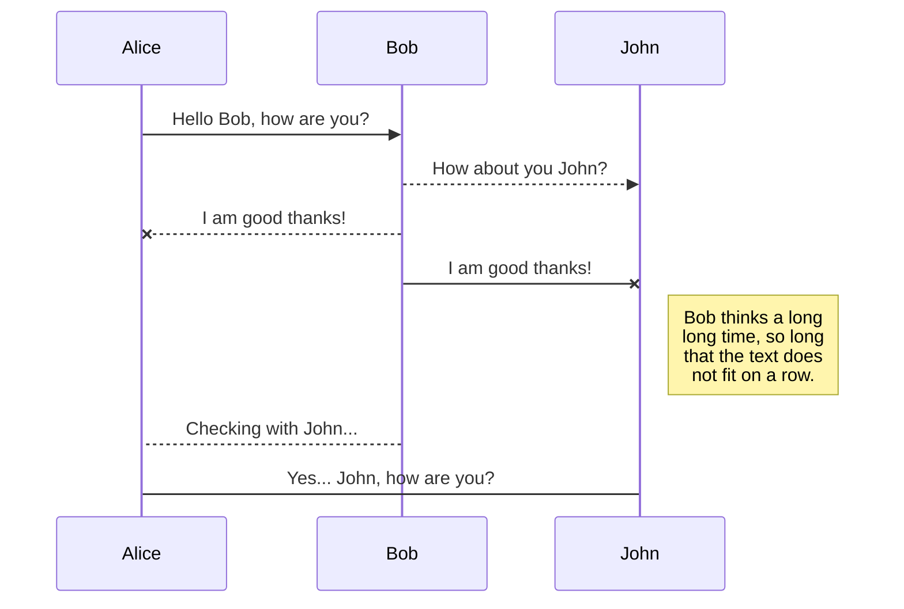

# Exam report DevOps, spring 2020
## Group noname

Emil Budtz-Jørgensen (embu@itu.dk), 
Frank Andersen (fand@itu.dk), 
Liv Hartoft Borre (livb@itu.dk), 
Morten Skøtt Knudsen (mskk@itu.dk), 
Simon Bodekær Black (sibl@itu.dk) 

## Content
# System's Perspective
[100 System's Perspective](https://github.com/mortenskoett/itu-devops-group-noname/blob/report/report/100_systems_perspective.md)

[101 Design and Architecture](https://github.com/mortenskoett/itu-devops-group-noname/blob/report/report/101_design_and_architecture.md)

[102 Dependencies](https://github.com/mortenskoett/itu-devops-group-noname/blob/report/report/102_dependencies.md)

[103 Interactions of Subsystems](https://github.com/mortenskoett/itu-devops-group-noname/blob/report/report/103_interactions_of_subsystems.md)

## Process' Perspective

[200 Process Perspective](https://github.com/mortenskoett/itu-devops-group-noname/blob/report/report/200_process_perspective.md)

[201 Stages and Tools](https://github.com/mortenskoett/itu-devops-group-noname/blob/report/report/201_ci_dc_chain_tools.md)

[203 Development Process and Tools](https://github.com/mortenskoett/itu-devops-group-noname/blob/report/report/203_dev_process_and_tools.md)

[204 Monitoring and Logging](https://github.com/mortenskoett/itu-devops-group-noname/blob/report/report/204_monitoring_and_logging.md)

[205 Secuerity Assessment](https://github.com/mortenskoett/itu-devops-group-noname/blob/report/report/205_sec_assessment.md)

[206 Scaling and Load Balancing](https://github.com/mortenskoett/itu-devops-group-noname/blob/report/report/206_scaling_and_load_balancing.md)

## 300 Lessons Learned Perspective

[300 Lessons Learned Perspective](https://github.com/mortenskoett/itu-devops-group-noname/blob/report/report/300_lessons_learned_perspective.md)

[301 Current System State](https://github.com/mortenskoett/itu-devops-group-noname/blob/report/report/301_current_system_state.md)


You can render UML diagrams using [Mermaid](https://mermaidjs.github.io/). For example, this will produce a sequence diagram:



And this will produce a flow chart:

```mermaid
graph LR
A[Square Rect] -- Link text --> B((Circle))
A --> C(Round Rect)
B --> D{Rhombus}
C --> D
