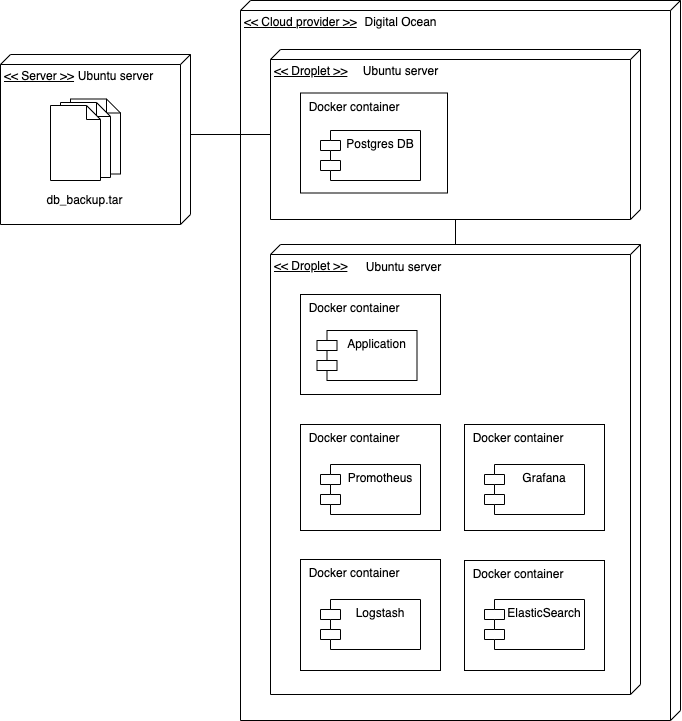
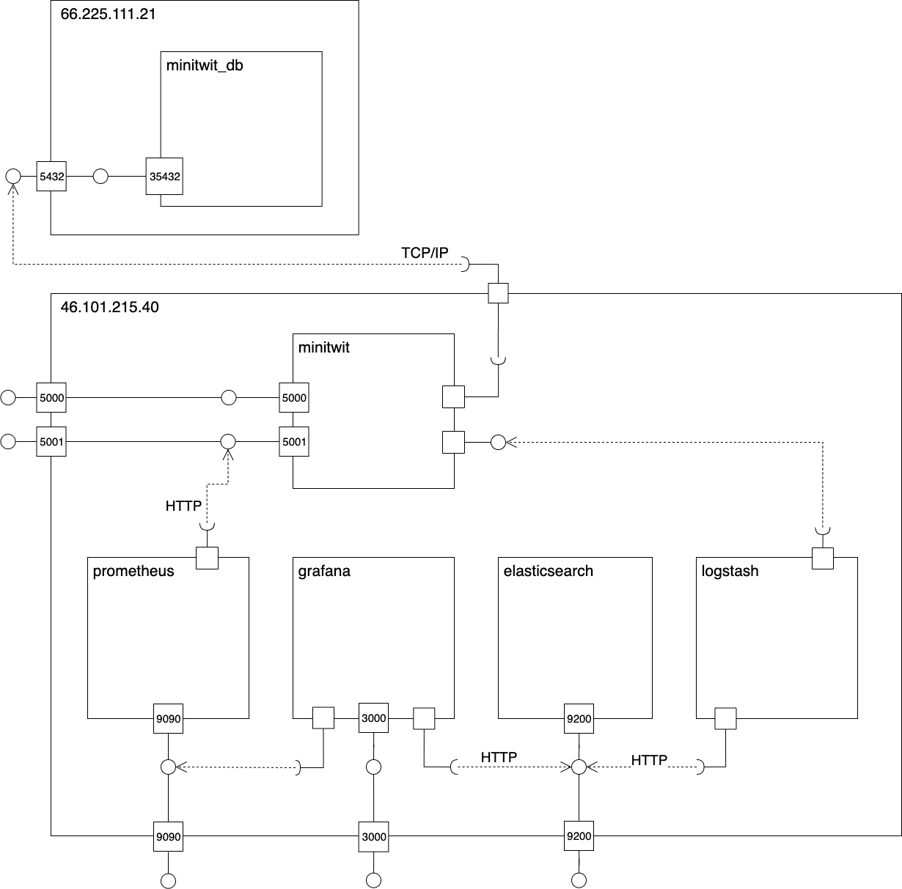
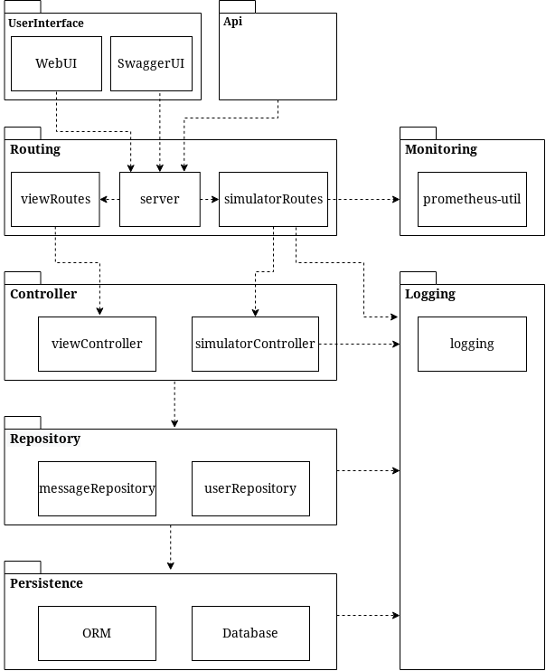

## 2.01 Design and Architecture

The following is an overview of the devices in our system, and the different applications or artifacts they are responsible for.

The following gives a quick overview of the subsystems. They will be presented in depth later on:
- minitwit consists of our web application - both the user interface and the API
- Prometheus is used for monitoring our system
- Logstash and Elasticsearch are used to handle the log data of our system
- Grafana is used for visualizing monitoring and log data
- minitwit_db is a database running a docker container on a separate server

All our subsystems except for the database run on the same Digitial Ocean droplet. Each subsystem runs in its own Docker container. This makes the system or subsystems very easy to deploy elsewhere. If for instance we wanted to deploy Grafana on a separate server we would just have to specify the new address the service is running at.

Originally the database was also running on the same server as the other subsystems but we migrated it to a new server when we wanted to make our system scalable. This is described in section 3.06.

We found that we did not need to distribute the subsystems on multiple nodes for the majority of this project. Our system was very efficient and performed well. From the beginning of the project we had chosen a powerful droplet so we did not have to scale our system vertically. However, having all subsystems on the same node made our system vulnerable as we had a single point of failure. + scaling, therefore later on we ...

## some diagrams
The following is an overview of the docker network and communication paths in our system. The outer boxes are the two servers, while the inner boxes are the docker containers. The names of the containers are their respective name within the docker network. The image displays what ports on the containers are mapped to what ports on the device, and hence communicates what ports are used to access the service from the outside, and what ports are used to access the ports within the docker network.

The following is an overview of the packages in our application.

---
[ [prev page](../chapters/200_systems_perspective.md) | [table of content](../table_of_content.md) | [next page](../chapters/202_dependencies.md) ]
