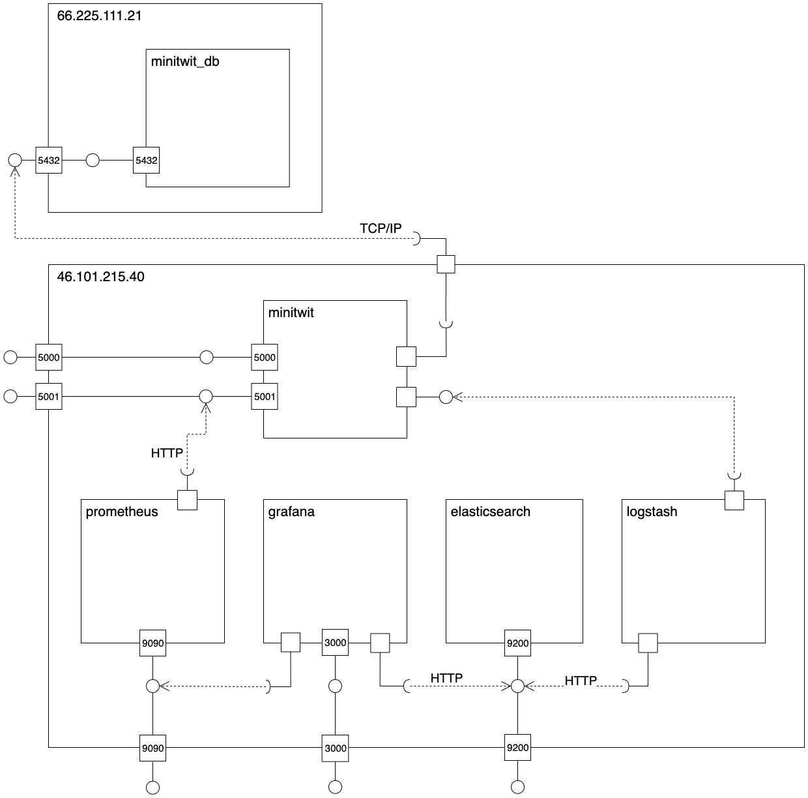

## 2.01 Design and Architecture

### Overview of System Architecture
The following diagram depicts is an overview of the subsystems of our system and on where they are deployed.

The following gives a quick overview of the subsystems. They will be presented in depth later on:
- Minitwit consists of our web application - both the user interface accessed through a browser and the API which the simulator accesses.
- Prometheus is a monitoring toolkit used to monitor the system.
- Logstash is a data processing pipeline used to ingest the log data of the system to Elasticsearch.
- Elasticsearch is a search engine used to handle the log data of the system.
- Grafana is a visualization toll used for visualizing monitoring and log data.
- Minitwit_db is a Postgres database running in a docker container on a separate server.

All our subsystems except for the database run on the same Digitial Ocean droplet. Each subsystem runs in its own Docker container. This makes the entire system or subsystems very easy to deploy elsewhere. If for instance we wanted to deploy Grafana on a separate server we would just have to specify the new address the service is running at.

Originally the database was also running on the same server as the other subsystems but we migrated it to a new server when we wanted to make our system scalable. This is described in section 3.06.

We found that we did not need to distribute the subsystems on multiple nodes for the majority of this project. Our system was very efficient and performed well. From the beginning of the project we had chosen a powerful droplet so we did not have to scale our system vertically. However, having all subsystems on the same node made our system vulnerable as we had a single point of failure. Further, we wanted to make our system able to be scaled horizontally. We therefore wanted to have multiple nodes running duplicates of our application. This is described in section 3.06.

### Docker Network
The following diagram shows an overview of the Docker network and communication paths between the subsystems. The outer boxes represent the two Digital Ocean droplets while the inner boxes represent Docker containers. The names of the containers are their respective name within the Docker network. The image displays what ports on the containers are mapped to what ports on the device, and hence communicates what ports are used to access the service from the outside, and what ports are used to access the ports within the docker network. Further, the diagram depicts which services are connected to eachother. This shows what services will be affected by changing another service. For instance, if we want to use another service instead of Elasticsearch, then we will have to find a service that both Grafana and Logstash can use - or also change these services.

Prometheus collects monitoring data that the application makes available on port 5001 at the /metrics endpoint. Grafana accesses data from the Prometheus service on port 9090. The Grafana service can be accessed on port 3000 in order to view the monitoring and logging dashboards for the system. Prometheus and Grafana are explained more in depth in section 3.04.

Logstash collects the log data written to a log file in the Minitwit application and sends the data to the Elastic search service running on port 9200. Grafana collects the data from this same port. The interaction between these subsystems is described in section 2.03.

The application is accessible through port 5000 and 5001. Port 5000 exposes the web application UI and port 5001 exposes the API which the simulator accesses. 

### Module Overview
**Packages eller modules?**
We have decided to use the layered architecture pattern for our application. This is a fairly simple pattern, which we found was a positive for a simple application like this. The layered architecture is easily testable and lets us change one of the layers without affecting the whole application. Changes only has to be made to the above layer if the new layer does not comply with the required API for that layer. Further, the layered architecture makes the overall application and interaction between the modules very easy to understand, which we saw as an important factor for a system that we had maintain. The layered architecture is not necessarily the most efficient as the requests have to pass through several layers. We did not find this to be a big problem for such a small application with simple layers and we valued the above-mentioned advantages higher than a possible slight loss of performance. 

The following diagram depicts the modules in our web application and the files that each module consists of. Requests from external actors are handled by server which passes on the request to either viewRoutes or simulatorRoutes depending on which port the request is sent to. viewRoutes handles the requests to the UI on port 5000 and simulatorRoutes handles the requests to the API at port 5001. The routing files will call the relevant methods of the controllers to handle the request. The controllers handle the business logic of the application and are responsible for sending the correct response codes back to the requester. The controllers will make use of the relevant repositories, which accesses the persistence layer. At the persistence layer is an ORM which makes it easy to exchange the database.

The controllers pass information about the requests we recieve and response codes we send to the monitoring module. This is some of the data that Prometheus monitors - it is described further in section 3.04. 

The routing, controller, repository and persistence modules all make use of the logging module in order to log certain events. This is described in detail in section 3.04.

### Choice of ORM?
**Ikke så meget at sige og virker lidt ligegyldigt, men vi skal måske lige nævne lidt?**
...

---
[ [prev page](../chapters/200_systems_perspective.md) | [table of content](../table_of_content.md) | [next page](../chapters/202_dependencies.md) ]
