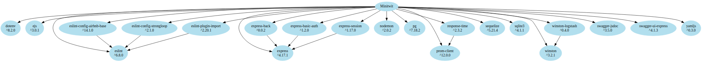

## 2.02 Dependencies

### Notes from session 3:
In class, we define a software artifact as *An artifact is a tangible machine-readable document created during software development. Examples are requirement specification documents, design documents, source code and executables.* (ISO/IEC 19506:2012 Information technology — Object Management Group Architecture-Driven Modernization (ADM) — Knowledge Discovery Meta-Model (KDM)).

Tasks:
Keep track of your dependencies. That is, all technologies, services, runtime and build-time dependencies should be logged in a corresponding file and/or visualization.
_____________________________

The only requirement for a machine to run a local version of our system is that Docker is installed since all our subsystems run in Docker containers. Using the run.sh script the docker images can be build and started. However, in order to develop, maintain and deploy the system there are quite a large number of dependencies. These dependencies of the system are depicted in the figure below.

DEPENDENCY GRAPH1 (har vi alt med?)

This directed acyclic graph depicts the dependencies of our system. At the top of the graph is the config file for CircleCI as this is the file that is used to deploy our system. The graph depicts both files and services that we depend on to deploy our code - that is both the compilation of the code and running the code.

This directed acyclic graph depicts the dependencies of our system. At the top of the graph is the CircleCI service as this service is used to deploy the system. The graph depicts both files and services that we depend on to deploy the system - that is both the compiletime and runtime dependencies.

CircleCI depends on the CircleCI config file and our Github repository from which it fetches the project. The CircleCI config file depends on some services in order to deploy the system. This is described in section 3.01. Further, it depends on the run.sh and backup.sh scripts. The run.sh script is the equivalent of the control.sh of the original system. With this script it is possible to build and run the subsystems via Docker. The backup.sh script is used to regularly create a backup of the production database and store it on an external server (home.oleandersen.net). 

The run.sh script is dependent on a number of docker-compose files to build and run the subsystems. The reason for having multiple docker-compose files is that we originally found that it made it easier to wait between deploying the individual subsystems. For instance, we had to wait for the database to start up completely before starting our application, which would connect to the database. Instead of having multiple different docker-compose files we should have just had a single one. Then we could have started the services of this docker-compose individually when we needed to. This is the setup that we have decided on in our scalable solution (see section 3.06).

Each docker-compose file is dependent on zero or more dockerfiles, which are dependent on services and/or files in order to be build and run.

In this graph it is depicted that the package.json file, which is needed to start the Node.js application, is only dependent on nodemon. The package.json file contains a list of libraries that our application is dependent on. These library dependencies are shown in the figure below.

This figure shows the dependencies of our Node.js application - the javascript code - based on the Package.json file. These libraries are installed by running the command "npm install". When deploying the code a docker container with NPM installed is used and the "npm install" command is run inside this container. Therefore, the machine on which the system is deployed does not need to have NPM or any of the libraries installed.

The dependency graph above helps get an overview of the libraries the code depends on. This overview is important when looking at the technical debt of the system. We can investigate these libraries and figure out the following:
- Are these libraries updated regularly or outdated?
- Are they well documented?  
- Are they widely used
- Know flaws or vulnerabilies

We used an online tool that was able to create the entire dependency graph of the Node.js application - also depicting the dependencies of the libraries shown in our dependency graph above. As this graph was very large and contained libraries we had never seen before we did not find it very helpful. We therefore chose not to include the dependencies of our dependencies in the graph. However, if some of the libraries our code depends on, depends on an outdated library then so does our code. This could be a library that is vulnerable to malicious attacks. The large graph could be useful in detecting such libraries that our code indirectly depends on.

---
[ [prev page](../chapters/201_design_and_architecture.md) | [table of content](../table_of_content.md) | [next page](../chapters/203_interactions_of_subsystems.md) ]