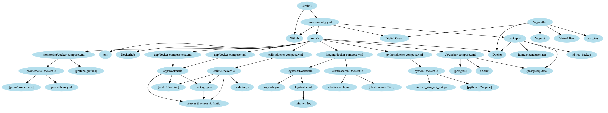

## 2.02 Dependencies
The only requirement for a machine to run a local version of our system is that `docker` and `docker-compose` is installed since all our subsystems run in Docker containers. Using the `run.sh` script the docker images can be build and started. However, in order to develop, maintain and deploy the system, there are quite a large number of dependencies. These dependencies of the system are depicted in the directed acyclic graph below (a larger picture is appended in [Appendix B](../chapters/500_appendices.md)).

The graph shows all artifacts, installed technologies and services that we depend on to develop, run, build and deploy our code (excluding the application specific files and Node.js dependencies, which are shown even further down)

At the root of the graph is the config file for CircleCI (described below), as this is the file that is used to deploy our system - nothing else in our system it dependant on that.

CircleCI depends on the `./.circleci/config.yml` file and the Github repository from which it pulls the project. The config file depends on various services in order to deploy the system, namely the `run.sh` and `backup.sh` scripts. 
The `run.sh` script is dependent on a number of `docker-compose` files to build and run the subsystems. 

Reasoning and discussion of the `run.sh` script can be found in 
section [4.01 - Current System State](../chapters/401_current_system_state.md).
Experiences with a more conventional solution can be found in
section [3.05 - Scaling and Load Balancing](../chapters/305_scaling_and_load_balancing.md).

Each docker-compose file is dependent on zero or more Dockerfiles, which are dependent on services and/or files in order to be build and run. Base images are depicted by square-brackets, e.g. \[node:10-alpine\].

In this graph it is shown that the `package.json` file, which is needed to start the Node.js application, is only dependent on the application code in server, views, and static (which are depicted together for simplicity). The `package.json` file describes the list of libraries that our application is dependent on. These library dependencies are shown in the figure below (a larger image is found in [Appendix B](../chapters/500_appendices.md)).

This figure shows the dependencies of our Node.js application - the JavaScript code - based on the `package.json` file. 

To run the application, the device needs to have Node.js, NPM and these libraries, which are installed by running the command `npm install`. However, when deploying the code, we use a docker container with Node.js and NPM installed and then run the command inside the container, before spinning up the application. 

Therefore, with the help of containerization, the machine itself on which the system is deployed does not need to have Node.js, NPM or any of the libraries installed as it only depends on Docker.

The dependency graph above helps get an overview of the libraries the code depends on. This overview is important when looking at the technical debt of the system. We can investigate these libraries and figure out the following:
- Are these libraries updated regularly or outdated?
- Are they well documented?
- Are they widely used?
- Know flaws or vulnerabilies?

If some dependency also has a dependency on an outdated library then so does our code. This could be a library that is vulnerable to malicious attacks. These graph could be useful in detecting such dangerous dependencies. As a comfort Github automatically warns about such dependencies, however this service should be used more intentionally on our behalf, in order to mitigate the risk effectively. 

---
[ [prev page](../chapters/201_design_and_architecture.md) | [table of content](../table_of_content.md) | [next page](../chapters/203_interactions_of_subsystems.md) ]
