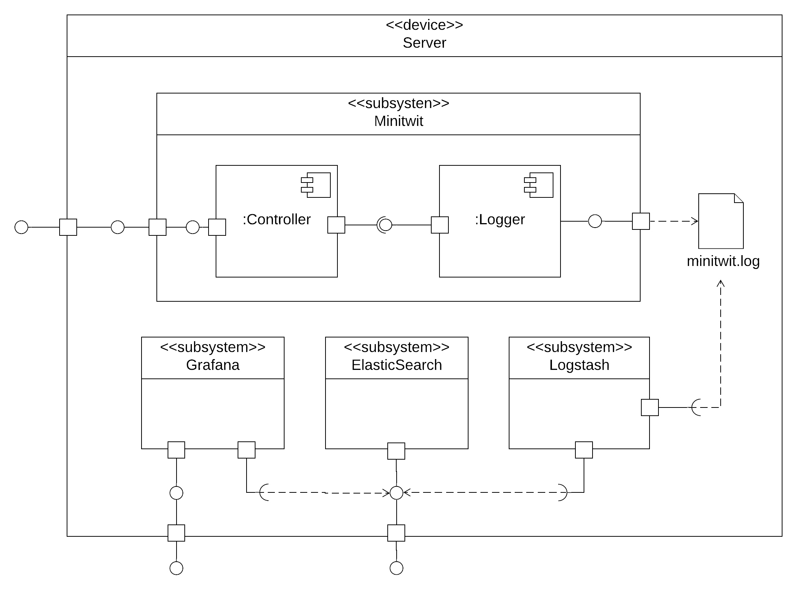

## 2.03 Interactions of Subsystems
This chapter will zoom in on some of the subsystems and their interactions with each other.

### Monitoring services
To monitor our system we make use of Prometheus. Prometheus is a monitoring toolkit that collects data about the machine on which our application is running. Prometheus also allows us to specify metrics in our code that should be collected. The Prometheus data is fetched by the analytics platform, Grafana, which lets us visualize the data in dashboards. 

We have chosen to use Prometheus since it is one of the leading monitoring tools on the market, used by several large IT-companies. Prometheus makes it able to monitor the application as we wanted to in an efficient way.

One of the major reasons for choosing Grafana was also that it is one of the leading tools on the market. Grafana is used by companies such as PayPal, Intel, Ebay and Vimeo. We thought that Grafana would be adequate for this project but also a tool that we wanted to get some experience with. Another requirement we had to the choice of visualization tool was that it supported a variety of data sources so that we could change our monitoring service if we wanted. Grafana supports different data sources and this turned out to be useful when we had to use logging for our system.

Grafana and Prometheus worked well together and it was fairly easy to set up the services as a part of our system. 

### Logging
For the logging of our system we use the following services:
- Winston, a JavaScript logger.
- Logstash, a data processing pipeline.
- Elasticsearch, an efficient search and analytics engine.

The following is an overview of how logging works in the system:
We have the Minitwit application as a subsystem, which is the Node.js application providing the web and api interfaces. Within we have controllers, which handle the incoming requests, and the controller communicates with a logger, which writes the logged entrance to a file on the device. We use Winston to write logging statements in our code that will write to our log-file. The data of the log-file is regularly collected by the Logstash service for processing the entrances into the right format, which in our case is JSON. It sends the entrances to the Elasticsearch service, which functions as a database for JSON and provides efficient string searches in the data. Finally, Grafana accesses Elasticsearch and displays the content in a nice UI.

We decided to use Winston as our logger since it is a simple lightweight logger that supports our needs. We did not have many requirements for our choice of logger - we just needed to be able to output logs with different priority levels. Winston is the officially recommended setup on Loggly’s documentation for Node (https://documentation.solarwinds.com/en/Success_Center/loggly/Content/admin/node-js-logs-2.htm?cshid=loggly_node-js-logs) so we found it to be a good choice.

We decided to use Elasticsearch as it is a very efficient search engine that has gained a great amount of popularity over the last few years. Elasticsearch is JSON-based and works very well for log data. Logstash is a lightweight tool that allows us to easily ingest our data into Elasticsearch. Elasticsearch and Logstash are part of the increasingly popular stack 'ELK' that allows for collecting logdata and visualizing it. We found that these two tools were the preffered ones as the ELK stack is very modern and scalable. The tools were able to handling the logging for this project but also some tools that we wanted to have experience with as they are widely used.

To visualize the log data we make use of Grafana as for our monitoring dashboard. We initially tried to use Kibana, which is the visualization tool used in the ELK stack. However, we found that Kibana had a large amount of CPU usage. When looking for a more lightweight solutions we found that Grafana, which was already running on our server, was also able to visualize data from Elasticsearch - we just had to update the version of Grafana we were using. This was done by simply updating the version number in the dockerfile for Grafana. We thereby use Grafana for visualizing both the monitoring and log data.

### Backing up and restoring data
Backing up of the database has been automated and the data is backed up every 6 hours by a backup daemon running on the server. The daemon is instantiated using the `backup.sh` script which was written to handle backing-up and restoring data.
See deployment diagram in section [2.01 - Design and Architectur.e](../chapters/201_design_and_architecture.md)

When a backup is initiated, a dump of the database is created and stored locally in the docker container. It is then copied to the host of the container and finally transferred to the external backup server along with a timestamp using `scp`. On the backup server a total of 3 redundant backups are stored at all times, maintained by the daemon. 

A backup can be initiated without the database is taken down, however it is unknown to us how big an impact this operation has on the performance of the database.

The setup requires that the backup server accepts connections using the SSH key stored on the database server. Setting up the key on the server has not been automated.

---
[ [prev page](../chapters/202_dependencies.md) | [table of content](../table_of_content.md) | [next page](../chapters/300_dev_process_and_tools.md) ]
