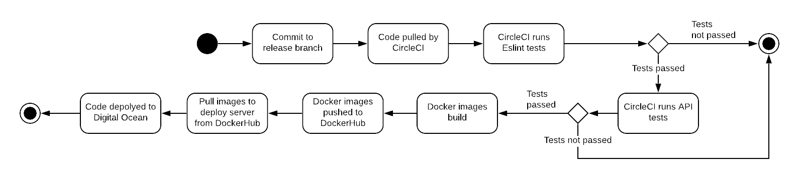

## 3.01 Stages and Tools used for CI/CD chain

NOTES FROM SESSION 4
In this session we implement a continuous integration (CI) chain using the following technologies and tools:
- the distributed version control system (VCS) Git (https://git-scm.com) and GitHub (https://github.com) as host,
- the build server service Travis CI (https://travis-ci.com/),
    - Why did we choose CircleCI over Travis or Github Actions?
    - Why choose CI/CD as a service vs. self-hosted like Jenkins (most often in bigger organizations and companies)?
- Docker containers (https://www.docker.com) and DockerHub (https://hub.docker.com) as a public registry,
- Vagrant (https://www.vagrantup.com) to setup and manage virtual remote machines
- and the cloud server provider Digital Ocean (https://www.digitalocean.com).

Tasks:
- **OBS MSc students:** Remember to log and provide good arguments for the choice of CI/CD system, i.e., why do you choose your solution instead of any other?
- You choose freely if you want to go for continuous delivery or continuous deployment.
- Let your build pipeline contain not only building your application but also execution of your test suite and other appropriate build stages.
___________________
For our CI/CD chain, we are using Vagrant and CircleCI.
We use **Vagrant** to start a droplet on DigitalOcean (DO). By installing Vagrant, we can write a Vagrant file specifying what server and installations we want (declaring that we are using DO, where to find our credentials, and what server and images we want it to create), and then make Vagrant set up the desired server on our DO account. Instead of relying on Vagrant, we could just create and configure a droplet manually (using the DO website or the terminal), but it is better to have the exact setup and configuration written down as code, so that we can easily redo it again later: this is what Vagrant help to do.

**Write something about why choosing CircleCI over Travis**
We use **CircleCI**, which provides CI/CD as a service, to automate testing of our code and deployment to DO. We have set up a service on CircleCI, which listens on our different branches on GitHub, and does different things; pushing to any branch will make CI run our tests, and pushing to release will make CI run our tests and then automatically deploy.

When we push new commits to any git branch, CircleCI will fetch our code from GitHub and run our tests. If the tests fail we will be notified with an e-mail. Further, on Github each branch is marked with a checkmark or a cross indicating whether the code has passed the tests.

We deploy our code by commiting to the release branch (see chapter 3.02).
Stages used for our CI chain:
- Push code to the release branch
- CircleCI fetches the code from GitHub and runs our test script
    - If the tests fail, we are notified and no further actions are made
- CircleCI pushes the docker images to DockerHub
- CircleCI runs our deploy script, which deploys our code to our Digital Ocean server

Our tests consist of an Eslint check and some tests for our API. Eslint is a linter for JavaScript code, which ensures that we keep a code standard. Eslint can be run locally and even integrated into the IDE so that errors can be found before the tests are run on the CircleCI server.

The below diagrams illustrates the activities for Circle CI in our deployment chain.

The below diagram is an overview of the services involved in our deployment chain:

---
[ [prev page](../chapters/300_process_perspective.md) | [table of content](../table_of_content.md) | [next page](../chapters/302_repo_and_branch_strategy.md) ]
