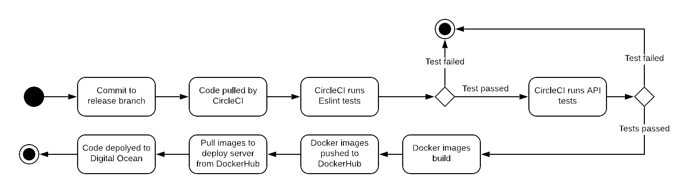

## 3.02 Stages and Tools used for CI/CD chain
This chapter describes how the pipeline is setup and reasons about the choice of services.

### Continuous integration / continous delivery (CI/CD)
This section describes the continuous integration and continuous delivery chain of our system. We have chosen continuous delivery and not continuous deployment in the sense that in order to start the deployment of our code we have to push to the release branch. Pushing to the release branch requires a code review from two other members of the team. Therefore deployments do not happen automatically every time a new change is made and potentially deployable code is not always deployed. 

The reason for choosing continuous delivery over continuous deployment was that we wanted a thorough review of the code before it was deployed and released to reduce the risk of the system crashing in production. While continuous deployment would be good, the risks are higher and requires a bullet-proof test suite.

### Services
For our CI/CD chain, we are using Vagrant and CircleCI.
We use *Vagrant* to start a droplet on DigitalOcean (DO). By installing Vagrant, we can write a Vagrant file specifying what server and installations we want (declaring that we are using DO, where to find our credentials, and what server and images we want it to create), and then make Vagrant set up the desired server on our DO account. Instead of relying on Vagrant, we could create and configure a droplet manually (using the DO website or the terminal), but it is better to have the exact setup and configuration written down as code, so that we can easily redo it again later - this is what Vagrant helps us to do.

For the choice of continuous delivery we had multiple candidates to choose from. The ones that were up for debate were Github Actions, Jenkins, Travis and CircleCI.

Based on the talk held by an external lecturer, we got a feeling that Github Action was still the new kid in the class, even if well integrated with Github, we wanted to get acquainted with some of the other tools used in the industry, so Github Action was dismissed.

Next up was Jenkins, even if it's completely free and open-source, it would requires us to setup a (separate) server and install in on. This does sound cool, but would mean another instance for us to keep a float.

Left was Travis and CircleCI, both supporting Git and Docker and as hosted a solution in the cloud. So a close race!
After some research we came to the conclusion that CircleCI was well established and it made sense with their "free plan" compared to a paid solution with Travis.

(https://medium.com/hackernoon/continuous-integration-circleci-vs-travis-ci-vs-jenkins-41a1c2bd95f5)

(https://www.slant.co/versus/625/627/~circleci_vs_travis)

We use *CircleCI*, which provides CI/CD as a service, to automate testing of our code and deployment to DO. We have set up a service on CircleCI, which listens on our different branches on GitHub.

When we push new commits to any git branch, CircleCI will pull our code from Github and run our tests. If the tests fail we will be notified with an e-mail. Further, on Github each branch is marked with a checkmark or a cross indicating whether the code has passed the tests.

### Deployment
We start the deployment of our code by merging into to the release branch. The below activity diagram illustrates the activities for CircleCI in our deployment chain.

Stages used for our CI chain:
- Push code to the release branch
- CircleCI pulls the code from GitHub and runs our tests
    - If the tests fail, we are notified and no further actions are made
- CircleCI pushes the docker images to DockerHub
- CircleCI runs our deploy script, which deploys our code to our Digital Ocean server

The diagram below gives an overview of the services involved in our deployment chain and the steps described above:

The tests run by CircleCI consist of an Eslint check and some tests for our API. Eslint is a linter for JavaScript code, which ensures that we keep a code standard. Eslint can be run locally and even integrated into the IDE so that errors can be found locally before the tests are run on the CircleCI server. 

The tests for the API are not very extensive but they ensure that the system can be build and responds to requests. Having this automated deployment setup greatly reduced our concerns about deploying code to the server, and enabled us to deploy more often, which is reducing the lead time of new features, thus benefitting the team as well as users. We found this to be very valuable for future work as system developers.

---
[ [prev page](../chapters/301_repo_and_branch_strategy.md) | [table of content](../table_of_content.md) | [next page](../chapters/303_monitoring_and_logging.md) ]
