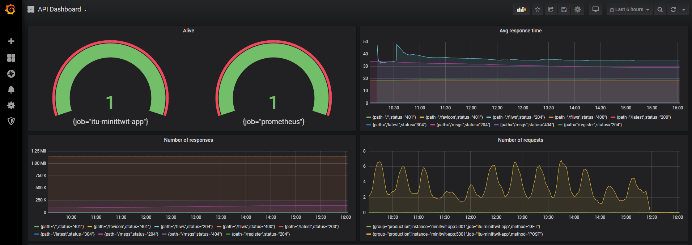
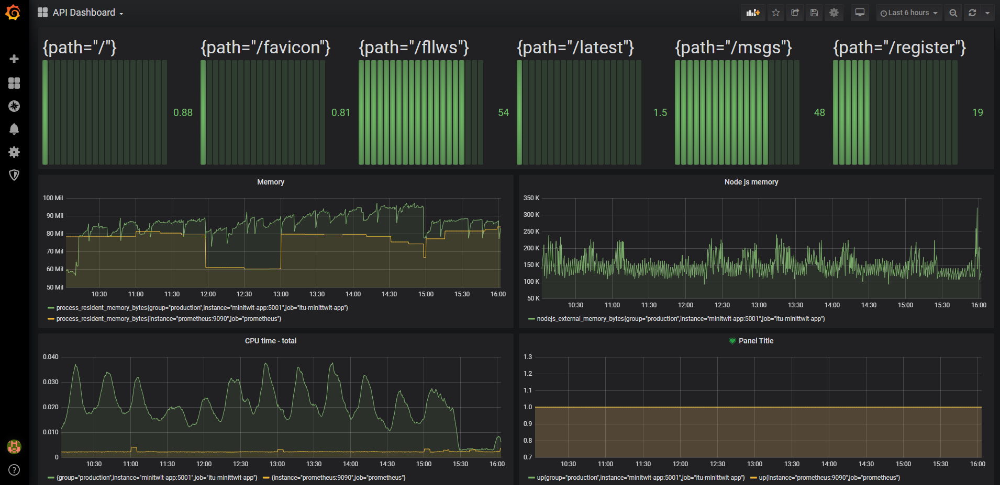

## 3.03 Monitoring and Logging
This chapter describes the monitoring and logging tools used in the project.

### Monitoring
In order to monitor our system, we make use of whitebox application monitoring. That is, we monitor the machine on which our application is running as well as the requests the API receives and the responses the API sends. 

We monitor the following metrics, which are shown in the Grafana dashboard:
- Whether the system is running
- The total number of requests for each endpoint
- The rate of requests to the system for each endpoint
- Number of responses we send for each status code and endpoint
- Average response time for each endpoint and status code
- CPU usage
- Memory usage

The monitoring for this project has been reactive in the sense that our monitoring is automatic but we do not monitor our system with a focus on the business outcomes, quality of service and customer experience as is done in proactive monitoring. We mostly used monitoring for making sure our system was running as expected and to check the efficiency of each endpoint in our system. Our monitoring was, however, still manual in the sense that we had to check our monitoring dashboard to get information about the state of our system. This caused some problems that we will discuss later.

If we had actual users we would had used more energy on monitoring the business logic of our system instead of just the application. We did not feel the need to monitor business logic for this project as our only user was the simulator. In order to optimize the results for the simulator we had to ensure that our application was running efficiently which we checked with our application monitoring. 

Because of the data about our application from the simulator we did not do any blackbox monitoring - the figures on the course Github page acted as blackbox testing of our system. These figures showed that we were sending the expected response codes to the requests. If we had not had the simulator data we should setup some monitoring from outside our system to see that we responded correctly to requests.

Monitoring our system did not help us that much for this project as for the majority of the project duration not many unusual things were happening to our system or the simulator sending requests. The monitoring would probably have been more useful for a *real* project, for which we could analyze the behaviour of our users and how our system would handle different amounts of load. 

Monitoring could, however, have been very helpful in the last weeks of the project when we did not realize our system had been down for days. If we had setup monitoring to notify us when the app was down, we would have noticed much sooner. After we realized our system had been down without us noticing we made Grafana send a mail to us in case our system would not respond for some seconds. The system being down unnoticed in described further in [section 4.00](../chapters/400_lessons_learned_perspective.md).

### Logging
Besides monitoring the system we also use logging to keep track of how the system is used and errors in the system. 

We log the following:
- The requests we receive - what endpoint was requested
- The response codes we send and which endpoint the response was sent from (which endpoint was requested)
- Any exceptions that are thrown in the code
- If we receive an unauthorized request, we log the credentials used by the request - if any. This allows us to detect brute force login attacks on the system.

The logging did not help us that much for this project as we already had access to most of the data through the monitoring. The logging kept track of exceptions thrown in the code and unauthorized access, which the monitoring did not. The tracking of unauthorized accesses was useful when we had to try to detect any attacks on our system as part of the security assessment. There were only very few unauthorized accesses, though - all without credentials.

We could have logged the call time of the individual functions in our code to get a better idea of exactly where to improve our system. In this way the logging would provide some data that the monitoring could not - besides exceptions and unauthorized access. 

---
[ [prev page](../chapters/302_ci_dc_chain_tools.md) | [table of content](../table_of_content.md) | [next page](../chapters/304_sec_assessment.md) ]
