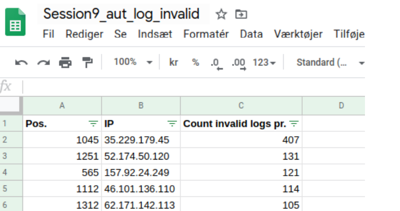

## 3.05 Security Assessment

In session 09, the focus on security became a main focus. To keep being a dependable developer and system provider with a secure product, it's important to have a clear understanding about what is most importent and what steps to take in the case of a security breach or a directly devastating (hacker) attack.

So to deliver trust, a proactive a systematic approach needs to be in place for our complete ITU-MiniTwit system.

So the following route was followed
- Risk assessment
- Penetration testing
- Detection
- Recover

All work and thoughts is describe in the security assessment report, the paragraph below is a compressed conclusion and result of the work.

### Risk assessment
Our system consist of different parts which is prone to different risks in regards to their existence.
As described in earlier chapters, our systems relies on virtual machines located at our provider Digitalocean's cloud infrastructure, and even if the concept of cloud is used, it's still at some point at risk for natural causes hitting the datacenter, like flood's, lightning or human interfering. But even if this would be catastrophic for us, it would be an extremely rare as Digitalocean is expected to have tried to mitigate and foresee this kind of events.

What we could do, but do not include is a strategy for moving to another provider in this case. What we have done is prepare our deployment strategy in a way that let's us redeploy our entire systems within a relative short timeframe.

### Penetration testing
We took the more general approach of penetration testing our system from the outside using port scanning and sql-injection attacks. This was done using the tool *nmap*, the scan did not real anything unexpected as the open port matched our running services.

We did come to the conclusion that not all port are needed to be accessible to the public, so an enhancement could include creating a whitelist of IP addresses authorized to access these ports.

We tried common sql-injection from the frontend, but the ORM used with nodejs, did prevent these.

### Detection
It's important to be able to detect malicious activity and intruders on our system. So ideally a baseline for the system load/usage should be included in the monitoring system, so spot excessive cpu, memory or other resource usage. And should be implemented for best practice.

Another way of being aware of intruders and the activity level of such is to have different kinds of system logs. In the security assessment we focused on checking system autorisation logs */var/log/auth.log* for "invalid" login attempts. What we saw was that our system did receive a lot of unwanted attempts.

To prevent this automated firewall rules based on failed attempts (ip ban) would make sense or a whitelist of allowed IP's.

Another, more complex way to spot intruders is that we could match a selected portion of our file-system with a initial backup, comparing hash values of each files to the ”original” searching for any alterations.

### Recover
In case that we should need to recover our system, we should be able to do so. With our solution on github, triple version backup (database) and a containerized setup, we should be able to redeploy or reshape our solution to another cloud provider, as long as teknologies liker docker are assumed working.

### Wrap up
As with all systems there will without doubt be security risks. We have tried to mitigate most of them and are fairly okay with the state of the system at hand. In futur development more fail testing and recovery scenarios would be worth investigating further.

Even if our system is considered safe right now, feature exploits might be found in dependencies later on, so this be kept in mind in the continuous development of the system.

---
[ [prev page](../chapters/304_monitoring_and_logging.md) | [table of content](../table_of_content.md) | [next page](../chapters/306_scaling_and_load_balancing.md) ]
