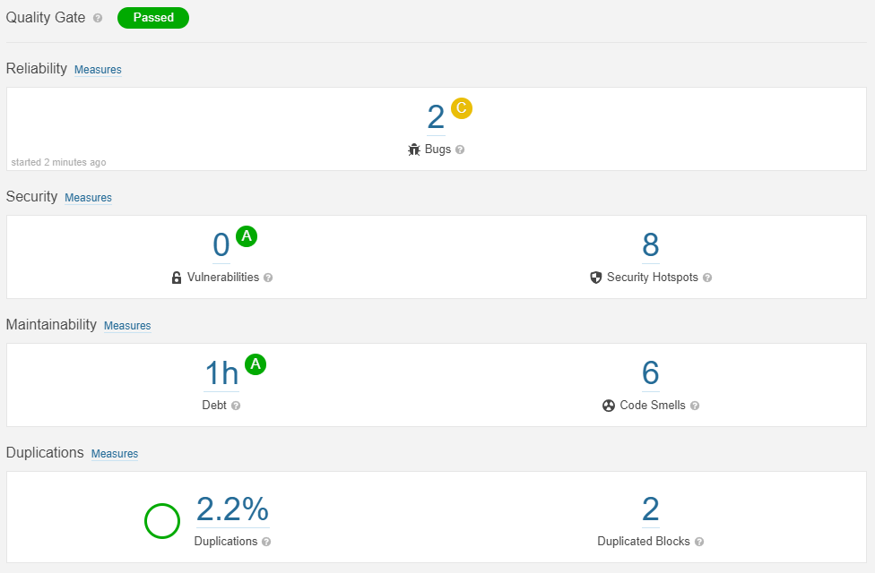

## 4.01 Current System State
<!-- // TOOD:
    db deployment - hvad betyder det? hvad mangler?
    -->

<!-- // TODO: Kan vi sige deploy her eller indeholder det også at starte en ny server op? -->
The system is currently not running on any servers but it can be easily deployed on a server using the run.sh script. Because all subsystems run in docker containers, the only requirement is a docker installation on the machine that the system shall be deployed on.

### Development & maintainability
All project documentation, credentials, source code, tests and deployment scripts are stored on our two github repositories. This means that including new members in our team only requires to add them to the project repositories. If we as a team is to be replaced all knowledge can be transferred and (commit) history can be reviewed easily.

The chosen languages and tools are all industry standards, meaning that it will all be fairly adaptable by others. Only custom scripts like /run.sh might be a challenge, but we have tried to make it fairly understandable with comments.

### Technical debt
As our system is newly developed it should not introduce much technical debt but technical debt is forming fast, especially when using things like Node.js, where many dependencies are automatically acquired. 

We have used the tool SonarCloud to analyze the software quality and technical debt of our code. The result is including only code files like JavaScript and Python and not config files like docker and vagrant. The image below shows the result.



The result is not that bad as the problems are all fairly small issues like concerns about some duplication, not using https for all request and a variable that might be null. Things that are easily fixed in an upcoming commit.

SonarCloud does not analyze the tools used for continuous integration and continuous delivery. These tools can also introduce technical debt in the system. Even though using these tools simplifies and structures the overall development process it also make us depend on external companies to be present for our system to be worked on as intended. If Github is no longer an available service, then our CI/CD chain does not work and we have to deploy our code in other ways. The CI/CD chain of our system only depends on large companies and industry standard services that we do not expect to introduce technical debt in the near future.

### Overall
For the most part, we feel our system is acceptable even though there are still many things we would like to improve. We have a working deployment strategy, monitoring and logging in place and a fairly success in serving our users (the simulator) with only a few hiccups.

So on most fronts we have a complete system that in the eyes of continuous integration is easily maintained and able to be extended with little to no downtime.

If more development should take place, the main thing we would work on is making the system easily deployable with docker swarm for load balancing so that the system is scalable. Further, we would extend our test suite so that we could be doing continous deployment instead of delivery.
 
<!-- ### System (re)deployment
When deploying the system in production mode the system will connect to an external database. The system can also be deployed in developer mode which will use a local database instead. The change between production and developer mode is done by changing an environment variable - this is variable is changed by the `run.sh` script.

To start the application in production mode run the following command: ./run.sh setup_run_app
To start the application in developer mode run the following command: ./run.sh setup_local_app

When deploying the system it can be decided whether or not to deploy the individual subsystems used for monitoring and logging. To run the monitoring and logging subsystems respectively, run the commands: 
```
./run.sh monitor -d
./run.sh logging -d
```

The tests for the system can be run using the following command: `./run.sh setup_run_test` -->

---
[ [prev page](../chapters/400_lessons_learned_perspective.md) | [table of content](../table_of_content.md) | [next page](../chapters/402_conclusion.md) ]