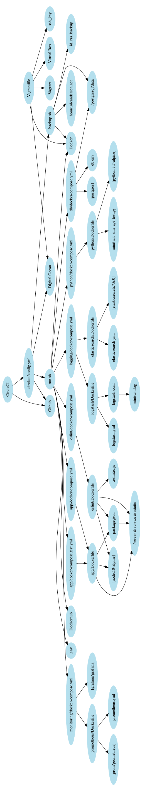

# 5. Appendix

## Appendix A
Technologies:
[Digital Ocean](https://www.digitalocean.com/)
[Ubuntu](https://ubuntu.com/)
[Github](https://www.github.com/)
[Docker](https://www.docker.com/)
[Vagrant](https://www.vagrantup.com/)
[CircleCi](https://www.circleci.com/)
[Grafana Labs](https://grafana.com/)
[SonarCloud](https://www.sonarcloud.io/)
[Prometheus](https://prometheus.io/)
[Swagger](https://swagger.io/)
[Elasticsearch](https://www.elastic.co/)

[Slack](https://slack.com/)
[Zoom](https://zoom.us/)

## Appendix B
### All dependencies

### Application level (npm) dependencies

---
[ [prev page](../chapters/402_conclusion.md) | [table of content](../table_of_content.md) | next page]